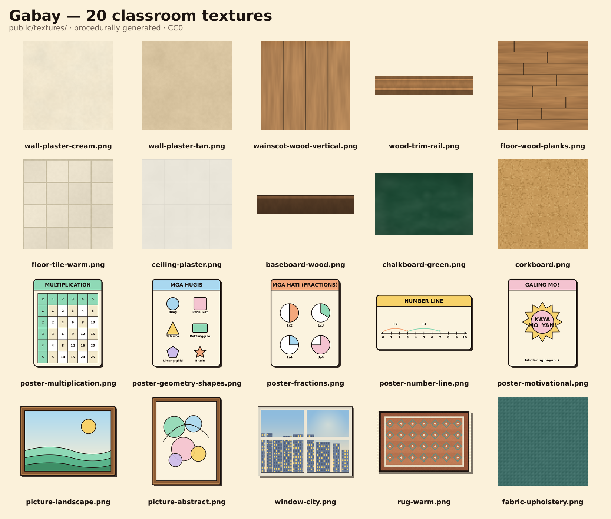

# Gabay

<p align="center">
  
</p>

<p align="center">
  
  
  
  
  
</p>

<p align="center">
  
  
  
  
  
</p>

> Offline-first AI study companion for Filipino Grade 6 learners, built by **Team GANGG**.

**Live app:** https://gabay-sage.vercel.app

Gabay is a mobile-first Progressive Web App that helps Grade 6 students practice Mathematics with Teacher Gabay, a friendly tutor mascot. The app combines curriculum-grounded lessons, adaptive mastery tracking, multilingual UI, voice support, a 2D tutor classroom, a textured 3D classroom simulation, and a Tindahan math game.

## Team

**Group Name:** Team GANGG

| Member | Role |
| --- | --- |
| Member 1 | Product / Research |
| Member 2 | Frontend / UI |
| Member 3 | AI / Backend |
| Member 4 | Demo / QA |

> Replace the member rows with the final submitted names before judging.

## Problem

Many Filipino learners study with inconsistent internet access. Typical AI learning tools depend on cloud-only chat, stable connectivity, accounts, and generic content. That makes them fragile for classroom demos and real home study.

Gabay is built around a practical requirement: the core learning loop should still work when the network is off.

## Solution

Gabay teaches Grade 6 Math through an offline-capable app shell, bundled curriculum content, local answer checking, local mastery storage, and optional online AI upgrades.

Online, Teacher Gabay can use Gemini, Gemini audio transcription, and Google Cloud Text-to-Speech. Offline, students can still open lessons, answer questions, review progress, play games, and hear fallback speech through the browser.

## How It Works

Gabay uses a local-first learning loop with optional online AI support.

1. **Load the app shell**
   - Vite builds the React app into static assets.
   - Workbox precaches the app shell, curriculum content, icons, textures, and bundled chunks.
   - After the first load, the core learning flow can reopen even with no network.

2. **Choose a language**
   - The learner selects Taglish, Tagalog, or English.
   - The preference is saved in IndexedDB.
   - UI labels, lesson text, feedback, speech language, and Teacher Gabay replies follow that setting.

3. **Pick a topic**
   - `src/content.json` stores the bundled Grade 6 competencies.
   - `src/lib/topics.js` maps competency refs to child-friendly titles, domains, and icons.
   - The app recommends topics using local mastery data.

4. **Learn in 2D or 3D**
   - The 2D classroom shows explanations, examples, practice, Teacher Gabay speech, and the ask panel.
   - The 3D classroom renders a textured classroom with Three.js, writes questions to the board, and opens the same answer modal near the board.

5. **Answer and get feedback**
   - `src/lib/check.js` checks answers locally.
   - `src/lib/feedback.js` creates localized feedback.
   - `src/lib/mastery.js` updates mastery in IndexedDB.
   - `src/lib/history.js` stores recent attempts for review.

6. **Use voice and AI when online**
   - `api/transcribe.js` sends short mic recordings to Gemini Flash for transcription.
   - `api/tutor.js` asks Gemini/Vertex for a Teacher Gabay response.
   - `api/tts.js` uses Google Cloud TTS for higher-quality voice output.
   - If those online services fail or the learner is offline, Gabay falls back to typing, cached/local explanations, and browser speech synthesis where available.

7. **Practice through games**
   - Tindahan Game reuses the same curriculum, answer checking, feedback, mastery, sound effects, and review history.
   - This keeps lessons, games, and classroom practice connected instead of becoming separate activities.

## Current Feature Set

### Learning Content

- 21 Grade 6 MATATAG-aligned competencies in `src/content.json`.
- Covers three domains:
  - Number and Algebra
  - Measurement and Geometry
  - Data and Probability
- Term-based curriculum resources included as PDFs:
  - `00_Curriculum_Dossier.pdf`
  - `Final_Year_End_Exam.pdf`
  - `Term1/`, `Term2/`, `Term3/` lesson plans, activity sheets, quizzes, and exams
- Child-friendly topic metadata in `src/lib/topics.js`.
- Filipino-context examples: sari-sari store, palengke, discounts, recipes, measurement, data, and probability.

### Global Language System

- Student chooses once: **Taglish**, **Tagalog**, or **English**.
- Preference persists offline in IndexedDB.
- Language drives:
  - navigation labels
  - topic screens
  - lesson explanations
  - answer hints
  - feedback
  - Teacher Gabay replies
  - speech language selection
- Core files:
  - `src/lib/lang.js`
  - `src/lib/i18n.js`

### 2D Classroom

- Chalkboard tabs for explanation, example, and practice.
- Teacher Gabay mascot with speech bubble.
- Read-aloud controls: play, pause, resume, listen again.
- Answer input with local checking through `src/lib/check.js`.
- Session summary and review of missed questions.
- Raise-hand panel for asking Teacher Gabay follow-up questions.

### 3D Classroom Simulation

- React harness in `src/screens/Classroom3D.jsx`.
- Three.js scene in `src/three/scene.js`.
- Textured classroom using bundled PNG assets from `textures/`.
- Offline-safe texture imports through `src/three/textures.js`.
- Features:
  - WASD keyboard movement
  - touch/mobile movement controls
  - mouse/touch look controls
  - zoom controls
  - textured walls, floor, ceiling, rug, window, corkboard, and posters
  - blackboard question rendering with CanvasTexture
  - proximity interaction at the board
  - answer modal using the same local checking and mastery engine
  - proper cleanup on exit

### Tindahan Game

- Store-themed math practice screen in `src/screens/Games.jsx`.
- Covers totals, discounts, ratios, percentages, and other Grade 6 skills.
- Adjustable number of questions.
- Coins and mastery updates.
- Uses the same local answer checker and mastery system.

### Adaptive Mastery and Review

- Mastery data is stored locally through IndexedDB.
- Correct answers raise mastery; wrong answers lower mastery and requeue review sooner.
- Progress screen shows mastery by topic.
- Review history records recent attempts for practice follow-up.
- Core files:
  - `src/lib/mastery.js`
  - `src/lib/history.js`

### Voice and AI

- `api/tutor.js`: Teacher Gabay online tutor via Vertex/Gemini.
- `api/transcribe.js`: Gemini Flash audio transcription for voice-in.
- `api/tts.js`: Google Cloud TTS voice-out.
- `src/lib/speech.js`: online TTS with browser `speechSynthesis` fallback.
- `src/lib/voicein.js`: mic recorder, Web Speech fallback, automatic recording stop, and request timeout.
- Voice-in behavior:
  - tap mic once
  - speak for up to about 7 seconds
  - recorder auto-stops
  - Gemini Flash transcribes
  - Teacher Gabay answers
- Offline behavior:
  - mic is disabled or falls back safely
  - student can still type questions
  - browser speech synthesis still works when available

### Offline-First PWA

- Vite + Workbox through `vite-plugin-pwa`.
- App shell and bundled assets are precached.
- Latest verified build precached 27 entries, including the textured 3D assets.
- Service worker auto-refreshes installed app bundles.
- No accounts required.
- No client-side API keys.

## Demo Flow

1. Open https://gabay-sage.vercel.app.
2. Choose a language: Taglish, Tagalog, or English.
3. Enter the hallway and pick a lesson.
4. Open the lesson brief.
5. Enter 2D Class or 3D Class.
6. Answer practice questions and watch mastery update.
7. Tap **Itaas ang kamay / Raise your hand** and use the mic or type a question.
8. Open the Tindahan Game and answer store-themed math questions.
9. Turn network off after first load and show that the core app still works.

## What Works Offline

- App shell and main screens
- Bundled curriculum content
- Lesson explanations and examples
- Practice questions
- Local answer checking
- Mastery and review history
- Tindahan Game
- 2D classroom practice
- 3D classroom assets and interaction
- Browser speech synthesis fallback when supported by the device

## What Needs Internet

- Gemini tutor endpoint
- Gemini Flash audio transcription
- Google Cloud Text-to-Speech
- Vercel API routes
- First-time loading before the service worker has cached the app

## Tech Stack

| Layer | Technology |
| --- | --- |
| Frontend | React 19, Vite 6, Tailwind CSS |
| PWA | vite-plugin-pwa, Workbox |
| Local Storage | IndexedDB through idb-keyval |
| 3D | Three.js, procedural geometry, bundled textures |
| AI Tutor | Gemini / Vertex through Vercel Functions |
| Speech-to-Text | Gemini 2.5 Flash, Web Speech fallback |
| Text-to-Speech | Google Cloud TTS, browser speechSynthesis fallback |
| Deployment | Vercel production |

## Project Map

```text
src/
  App.jsx                 screen routing, language, online state, mastery wiring
  content.json            21 bundled Grade 6 competencies
  main.jsx                app bootstrap and service worker registration
  lib/
    check.js              answer checking
    feedback.js           localized correctness feedback
    history.js            local review attempt history
    i18n.js               UI string table
    lang.js               global language persistence
    mastery.js            IndexedDB mastery + spaced repetition
    speech.js             online/offline voice-out
    topics.js             child-friendly topic metadata
    tutor.js              Teacher Gabay fallback chain
    voicein.js            mic recording + transcription fallback
  screens/
    Splash.jsx            app entry
    Home.jsx              hallway
    StartChoice.jsx       continue or browse
    TopicPicker.jsx       competency picker
    LessonBrief.jsx       lesson overview + 2D/3D entry
    Classroom.jsx         2D Teacher Gabay classroom
    Classroom3D.jsx       React harness for 3D classroom
    Games.jsx             Tindahan game
    Progress.jsx          mastery + review
  three/
    scene.js              3D classroom logic
    textures.js           bundled texture imports
  ui/
    BottomNav.jsx         persistent navigation
    Icons.jsx             app icons
    OnlineBadge.jsx       online/offline status
    Primitives.jsx        cards, buttons, chips, rich text, mastery bar
    Mascot.jsx            Teacher Gabay mascot
api/
  tutor.js                Gemini tutor endpoint
  transcribe.js           Gemini Flash transcription endpoint
  tts.js                  Google Cloud TTS endpoint
textures/
  *.png                   classroom wall, floor, poster, rug, window assets
Term1/ Term2/ Term3/       curriculum packets and assessments
```

## Run Locally

```bash
npm install
npm run dev
```

Open the Vite URL, usually:

```text
http://localhost:5173
```

## Production Build

```bash
npm run build
npm run preview
```

Use `npm run preview` for PWA testing because the service worker behaves like production only after a build.

## Offline Test

1. Run `npm run build`.
2. Run `npm run preview`.
3. Open the preview URL once while online.
4. In DevTools, set Network to **Offline**.
5. Hard refresh the page.
6. Confirm lessons, practice, progress, games, and 3D classroom still load.

## Environment Variables

Copy `.env.example` when configuring online AI services:

```bash
cp .env.example .env
```

Common variables used by the API routes:

```text
GCP_PROJECT=
GCP_LOCATION=
GCP_SA_KEY=
GEMINI_MODEL=
STT_MODEL=gemini-2.5-flash
TTS_VOICE=
```

### AI APIs Used

- **Teacher Gabay tutor:** Google Vertex AI / Gemini through `api/tutor.js`; default model is `gemini-2.5-pro`, configurable with `GEMINI_MODEL`.
- **Voice input transcription:** Gemini API audio understanding through `api/transcribe.js`; default model is `gemini-2.5-flash`, configurable with `STT_MODEL`.
- **Voice output:** Google Cloud Text-to-Speech through `api/tts.js`; default Filipino voice is `fil-PH-Wavenet-A`, configurable with `TTS_VOICE`.
- **Offline fallback:** browser `speechSynthesis`, typed answers, bundled content, and local answer checking keep the core app usable without the cloud APIs.

Do not commit real service account keys.

## Future Plan and Scaling

Gabay is built as a Grade 6 prototype, but the architecture can grow into a wider Filipino learning platform.

### Curriculum Scale-Up

- Expand from Grade 6 Math to Grades 4-10.
- Add more subjects: Science, English, Filipino, Araling Panlipunan, and TLE.
- Convert the included term PDFs into structured lesson packs.
- Add teacher-authored modules that can be downloaded once and reused offline.

### Personalization

- Use mastery history to recommend daily practice sets.
- Add learner profiles for siblings or shared classroom devices.
- Generate remedial paths for topics with repeated mistakes.
- Add parent/teacher summaries that work offline and sync when internet returns.

### AI Tutor Improvements

- Improve Taglish speech recognition with shorter prompts and better retry states.
- Add safer step-by-step tutoring guardrails for math explanations.
- Cache successful tutor explanations per competency for faster offline reuse.
- Add teacher-controlled prompts so schools can tune tone, language, and difficulty.

### Classroom and Game Expansion

- Add more explorable 3D rooms: library, math lab, school canteen, and home study corner.
- Turn Tindahan Game into a set of mini-games for measurement, geometry, data, and probability.
- Add classroom NPC dialogue for guided hints and encouragement.
- Add unlockable visual rewards tied to mastery, not ads or purchases.

### School Rollout Path

- Package lesson sets for low-connectivity schools.
- Support local-first sync for computer labs and tablets.
- Add teacher dashboards only after the learner app is stable.
- Keep the core app lightweight enough for budget Android devices.

## Call to Action

Try Gabay with one real learner and one real weak-signal scenario.

- **For judges:** test the airplane-mode flow after first load.
- **For teachers:** review the curriculum packs and suggest missing classroom examples.
- **For learners:** pick a language, answer a lesson, then ask Teacher Gabay a question.
- **For contributors:** help add more DepEd-aligned lesson packs, games, and offline-first learning tools.

**Gabay's goal:** make AI-assisted learning useful even when the internet is not reliable.

## Judging Highlights

- **Impact:** built for Filipino learners with unreliable connectivity.
- **Curriculum depth:** 21 Grade 6 competencies plus term resource packets.
- **Offline reliability:** local content, local checking, local mastery, cached app shell.
- **AI with graceful fallback:** online Gemini/TTS/STT when available, typed/offline flows otherwise.
- **Multimodal experience:** 2D tutor, 3D classroom, voice, and game-based practice.
- **Demo clarity:** easy airplane-mode moment after first load.

## Current Status

Built and deployed:

- Offline PWA shell
- Global language picker
- 21 Grade 6 competencies
- 2D Teacher Gabay classroom
- Textured 3D classroom
- Tindahan Game
- Progress and review tracking
- Online/offline status indicators
- Gemini tutor endpoint
- Gemini Flash transcription endpoint
- Google Cloud TTS endpoint
- Vercel production deployment

Final polish before judging:

- Replace Team GANGG member placeholders with final names.
- Add screenshots or a demo GIF.
- Run a full demo on the exact phone/laptop used for judging.
- Test mic permission and Taglish transcription on the demo device.

## Visual Identity

<p align="center">
  
  
  
</p>

- **Mascot:** Teacher Gabay, a friendly star guide for math practice.
- **Classroom style:** warm low-poly classroom with real bundled textures.
- **UI style:** soft neo-brutal cards, pastel colors, bold outlines, and large tap targets.
- **Demo line:** Online AI when available. Offline learning when it matters.

## References and Citations

- [DepEd MATATAG Curriculum](https://www.deped.gov.ph/matatag-curriculum/) - curriculum grounding and learning competency alignment.
- [React Documentation](https://react.dev/) - component-based frontend framework used by the app.
- [Vite Guide](https://vite.dev/guide/) - frontend build tool and development server.
- [Workbox Precaching](https://developer.chrome.com/docs/workbox/modules/workbox-precaching) - service worker precaching model used for offline-first behavior.
- [Three.js Documentation](https://threejs.org/docs/) - WebGL 3D rendering library used for the classroom simulation.
- [Gemini API Audio Understanding](https://ai.google.dev/gemini-api/docs/audio) - audio input support used by the transcription flow.
- [Google Cloud Text-to-Speech Documentation](https://cloud.google.com/text-to-speech/docs) - cloud voice generation used by Teacher Gabay when online.
- [Vercel Deployments Documentation](https://vercel.com/docs/deployments) - production hosting and serverless API deployment platform.

## Credits

Built by **Team GANGG**.

Gabay means guide or mentor in Filipino. The project is built as a practical study companion for Filipino learners, with math examples grounded in familiar local contexts and a classroom experience designed for mobile-first use.
