# Gabay

<p align="center">
  
</p>

<p align="center">
  
  
  
  
  
</p>

<p align="center">
  
  
  
  
  
  
</p>

<p align="center">
  
  
  
  
  
  
  
  
  
  
</p>

> **Your offline AI Math Companion** — built for Filipino Grade 4–6 learners by **Team CrossCampus**.

**Live app:** https://gabay-sage.vercel.app

**Jump to:** [Architecture and diagrams](#system-architecture) · [Feature set](#current-feature-set) · [Demo flow](#demo-flow) · [Tech stack](#tech-stack) · [Project map](#project-map) · [Run locally](#run-locally) · [Assets and logos](#visual-identity-and-assets) · [Roadmap](#future-plan-and-scaling)

Gabay is a mobile-first Progressive Web App that helps Grade 4–6 students practice Mathematics with Teacher Gabay, a friendly tutor mascot. The app combines curriculum-grounded lessons, AI-generated adaptive practice sessions, adaptive mastery tracking, multilingual UI, on-device and cloud AI tutoring, voice support, a 2D tutor classroom, a themeable textured 3D classroom simulation, ambient music/SFX, and four curriculum mini-games.

## Team

**Group Name:** CrossCampus

| Member | Role |
| --- | --- |
| Alea Grasha Masiglat | UI/UX + Researcher |
| Hannah Muñoz | Backend + Asset + UI/UX |
| Paul Henry Dacalan | Full Stack |
| Ethan Dreiz Baltazar | Full Stack + Project Manager |

## Problem

Many Filipino learners study with inconsistent internet access. Typical AI learning tools depend on cloud-only chat, stable connectivity, accounts, and generic content. That makes them fragile for classroom demos and real home study.

Gabay is built around a practical requirement: the core learning loop — and even AI tutoring on capable devices — should still work when the network is off.

## Solution

Gabay teaches Grade 4–6 Math through an offline-capable app shell, bundled curriculum content, local answer checking, local mastery storage, and a layered AI tutor that degrades gracefully instead of failing.

Teacher Gabay tries **on-device Gemini Nano** first (Chrome's Prompt API) — a fully offline AI reply with no network call at all. If Nano isn't available, it falls back to Gemini/Vertex online, and finally to a bundled cached explanation. The same "best available, never broken" philosophy drives adaptive question generation, audio transcription, and text-to-speech: every online upgrade has a working offline floor.

## Offline-First Promise

Gabay is designed to keep the core learning experience — and as much of the AI experience as possible — usable even when the internet is slow, unstable, or fully unavailable.

- **Works after first load:** the PWA caches the app shell, lesson content, icons, classroom textures, sound effects, and game assets.
- **Local learning loop:** onboarding, lessons, answer checking, feedback, mastery, language preference, attempt history, sound preferences, and game practice continue offline.
- **AI can work offline too:** on capable Chrome builds, Teacher Gabay answers questions fully on-device via Gemini Nano — no network required.
- **No cloud lock-in for studying:** cloud Gemini tutoring, adaptive question generation, Gemini transcription, and Google Cloud TTS are online upgrades, not requirements for learning.
- **Graceful fallback:** when online APIs (or Nano) are unavailable, learners get bundled question rotations, typed answers, cached explanations, and browser speech synthesis where supported.
- **Survives an offline reload:** Workbox serves the precached shell for navigation requests, so refreshing (or reopening) the installed app with no network shows Gabay, not the browser's error page.
- **Honest connectivity detection:** the app trusts a real request to `api/ping.js`, not `navigator.onLine`, so a throttled or captive-portal connection is treated as offline instead of pretending to be online.
- **Fails fast, not slow:** before committing to the 90s AI question-generation window, a 3s reachability check decides whether to even try — a dropped connection drops straight to bundled questions instead of stalling the loading screen.

## System Architecture

Everything inside the outlined **Learner device** box runs on the learner's device and keeps working with no network. Everything outside it is an optional upgrade.

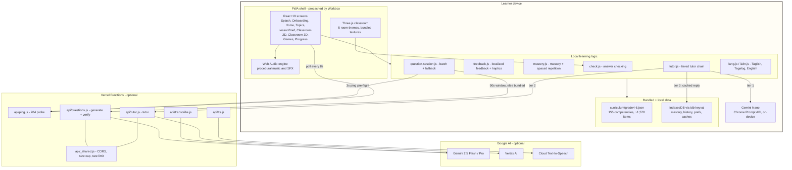
```mermaid
flowchart TB
  subgraph device["Learner device"]
    subgraph shell["PWA shell - precached by Workbox"]
      UI["React 19 screens<br/>Splash, Onboarding, Home, Topics,<br/>LessonBrief, Classroom 2D, Classroom 3D,<br/>Games, Progress"]
      THREE["Three.js classroom<br/>5 room themes, bundled textures"]
      AUDIO["Web Audio engine<br/>procedural music and SFX"]
    end
    subgraph logic["Local learning logic"]
      CHECK["check.js - answer checking"]
      FEED["feedback.js - localized feedback + haptics"]
      MASTERY["mastery.js - mastery + spaced repetition"]
      SESSION["question-session.js - batch + fallback"]
      TUTOR["tutor.js - tiered tutor chain"]
      I18N["lang.js / i18n.js - Taglish, Tagalog, English"]
    end
    subgraph data["Bundled + local data"]
      CURR["curriculum/grade4-6.json<br/>155 competencies, ~1,570 items"]
      IDB["IndexedDB via idb-keyval<br/>mastery, history, prefs, caches"]
    end
    NANO["Gemini Nano<br/>Chrome Prompt API, on-device"]
  end

  subgraph vercel["Vercel Functions - optional"]
    PING["api/ping.js - 204 probe"]
    QAPI["api/questions.js - generate + verify"]
    TAPI["api/tutor.js - tutor"]
    STT["api/transcribe.js"]
    TTS["api/tts.js"]
    GUARD["api/_shared.js - CORS, size cap, rate limit"]
  end

  subgraph google["Google AI - optional"]
    GEM["Gemini 2.5 Flash / Pro"]
    VERTEX["Vertex AI"]
    GTTS["Cloud Text-to-Speech"]
  end

  UI --> logic
  THREE --> CHECK
  UI --> AUDIO
  logic --> data
  SESSION -->|"3s ping pre-flight"| PING
  SESSION -->|"90s window, else bundled"| QAPI
  TUTOR -->|"tier 1"| NANO
  TUTOR -->|"tier 2"| TAPI
  TUTOR -->|"tier 3: cached reply"| IDB
  UI -->|"poll every 8s"| PING
  QAPI --- GUARD
  TAPI --- GUARD
  QAPI --> GEM
  TAPI --> VERTEX
  STT --> GEM
  TTS --> GTTS

  style device fill:#FFFDF5,stroke:#1C1410,stroke-width:2px
```

### Teacher Gabay tutor fallback chain

Three tiers, tried in order. The learner never sees a dead end.

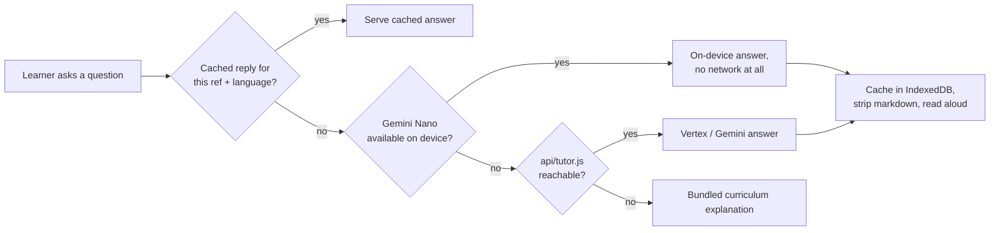
```mermaid
flowchart LR
  Q["Learner asks a question"] --> C{"Cached reply for<br/>this ref + language?"}
  C -->|yes| HIT["Serve cached answer"]
  C -->|no| N{"Gemini Nano<br/>available on device?"}
  N -->|yes| NANO["On-device answer,<br/>no network at all"] --> SAVE["Cache in IndexedDB,<br/>strip markdown, read aloud"]
  N -->|no| O{"api/tutor.js<br/>reachable?"}
  O -->|yes| CLOUD["Vertex / Gemini answer"] --> SAVE
  O -->|no| BUNDLE["Bundled curriculum explanation"]
```

### Adaptive question session

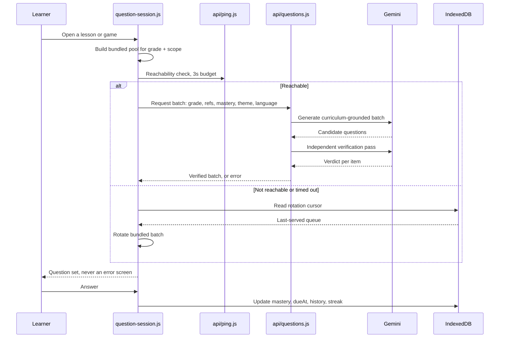
```mermaid
sequenceDiagram
  participant L as Learner
  participant S as question-session.js
  participant P as api/ping.js
  participant Q as api/questions.js
  participant G as Gemini
  participant I as IndexedDB

  L->>S: Open a lesson or game
  S->>S: Build bundled pool for grade + scope
  S->>P: Reachability check, 3s budget
  alt Reachable
    S->>Q: Request batch: grade, refs, mastery, theme, language
    Q->>G: Generate curriculum-grounded batch
    G-->>Q: Candidate questions
    Q->>G: Independent verification pass
    G-->>Q: Verdict per item
    Q-->>S: Verified batch, or error
  else Not reachable or timed out
    S->>I: Read rotation cursor
    I-->>S: Last-served queue
    S->>S: Rotate bundled batch
  end
  S-->>L: Question set, never an error screen
  L->>S: Answer
  S->>I: Update mastery, dueAt, history, streak
```

### Screen flow

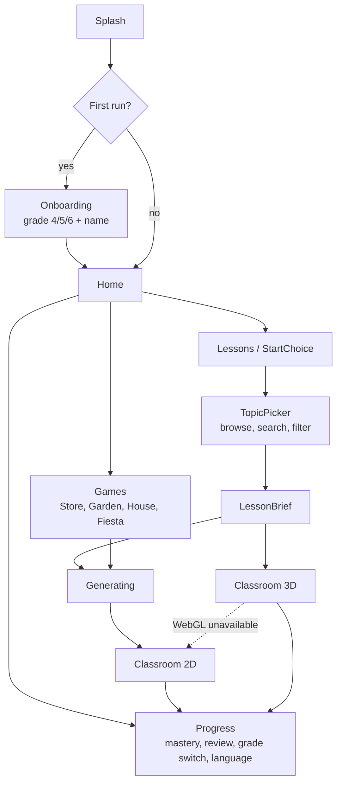
```mermaid
flowchart TD
  SPLASH["Splash"] --> ONB{"First run?"}
  ONB -->|yes| ONBOARD["Onboarding<br/>grade 4/5/6 + name"] --> HOME
  ONB -->|no| HOME["Home"]
  HOME --> START["Lessons / StartChoice"]
  HOME --> GAMES["Games<br/>Store, Garden, House, Fiesta"]
  HOME --> PROG["Progress<br/>mastery, review, grade switch, language"]
  START --> TOPICS["TopicPicker<br/>browse, search, filter"]
  TOPICS --> BRIEF["LessonBrief"]
  BRIEF --> GEN["Generating"]
  GEN --> C2D["Classroom 2D"]
  BRIEF --> C3D["Classroom 3D"]
  C3D -.->|"WebGL unavailable"| C2D
  C2D --> PROG
  C3D --> PROG
  GAMES --> GEN
```

### Local storage map

All learner state lives in IndexedDB through `idb-keyval` - no accounts, no server-side profile.

| Key | Holds |
| --- | --- |
| `gabay:studentName` | Learner name from onboarding |
| `gabay:selectedGrade` | Active grade (4, 5, or 6) |
| `gabay:mastery` | Per-competency mastery, scoped per grade |
| `gabay:dueAt` | Spaced-repetition due times per competency |
| `gabay:history` | Recent attempt history for review |
| `gabay:streak`, `gabay:lastAnswerDate` | Daily practice streak |
| `gabay:gamesPlayed` | Mini-game play counts |
| `gabay:question-rotation:<version>:<grade>:<mode>:<scope>` | Bundled-question rotation cursor |
| `tutor:<ref>:<lang>:<hash>` | Cached Teacher Gabay replies for offline re-reading |
| `pref:lang`, `pref:theme3d` | Language and 3D room theme |
| `sound:muted`, `sound:music` | Audio preferences |
| `gabay:3d-coached` | Whether the 3D board hint has been shown |

## How It Works

Gabay uses a local-first learning loop with layered, optional online AI support.

1. **Load the app shell**
   - Vite builds the React app into static assets.
   - Workbox precaches the app shell, curriculum content, icons, textures, sound effects, and bundled chunks.
   - `navigateFallback: index.html` (with `/api/*` denylisted) makes offline navigations and hard refreshes resolve from the precache.
   - After the first load, the core learning flow can reopen even with no network.

2. **Onboard once**
   - A first-time learner picks a grade (4, 5, or 6) and enters a name in `src/screens/Onboarding.jsx`.
   - Grade and name persist in IndexedDB; returning learners skip straight to the hallway.
   - The learner can also choose Taglish, Tagalog, or English; that preference drives navigation labels, lesson text, feedback, speech language, and Teacher Gabay replies via `src/lib/lang.js` and `src/lib/i18n.js`.

3. **Browse lessons**
   - `src/curriculum/grade4.json`, `grade5.json`, and `grade6.json` store the bundled competencies for the learner's grade.
   - `src/lib/topics.js` maps competency refs to child-friendly titles, domains, and icons; `src/lib/progress.js` gives every screen one shared "started / in progress / completed" vocabulary.
   - `src/screens/Lessons.jsx` recommends the next topic using local mastery data; `TopicPicker.jsx` supports full browse/search/filter.

4. **Learn in 2D or 3D**
   - The 2D classroom shows explanations, examples, step-by-step guided practice (`src/ui/StepScaffold.jsx`), Teacher Gabay speech, and the ask panel.
   - The 3D classroom renders a textured classroom with Three.js, lets the learner pick one of five room themes (Classic, Forest, Ocean, Sunset, Night), writes questions to the board, and opens the same answer modal near the board.

5. **Get a fresh practice session**
   - Entering a lesson shows a short `Generating` screen while `src/lib/question-session.js` requests an AI-generated, curriculum-grounded question batch from `api/questions.js` (Gemini generates, then an independent Gemini pass verifies every item before it's used).
   - A 3s ping check (`REACHABILITY_TIMEOUT_MS`) runs first, so the app only commits to the 90s generation window when the network is actually reachable.
   - If generation, verification, or the network fails, the session falls back instantly to a locally rotated batch from the bundled curriculum — the learner never sees an error.

6. **Answer and get feedback**
   - `src/lib/check.js` checks answers locally.
   - `src/lib/feedback.js` creates localized feedback (plus haptic vibration cues).
   - `src/lib/mastery.js` updates mastery in IndexedDB, scoped per grade.
   - `src/lib/history.js` stores recent attempts for review.

7. **Use voice and AI when online (or on-device)**
   - `src/lib/tutor.js` answers "raise hand" questions through a three-tier chain: on-device Gemini Nano → `api/tutor.js` (Vertex/Gemini) → a cached bundled explanation.
   - `api/transcribe.js` sends short mic recordings to Gemini Flash for transcription, with a Web Speech API fallback.
   - `api/tts.js` uses Google Cloud TTS for higher-quality voice output; `src/lib/speech.js` falls back to the browser's `speechSynthesis`.
   - If online services and Nano are all unavailable, Gabay falls back to typing and cached/local explanations.

8. **Practice through games**
   - Store, Garden, House Builder, and Fiesta games reuse the same curriculum, adaptive question sessions, answer checking, feedback, mastery, sound effects, and review history.
   - Curriculum badges show the skill area for each game, and finish summaries show score, accuracy, coins, and missed-item review.
   - This keeps lessons, games, and classroom practice connected instead of becoming separate activities.

## Current Feature Set

### Learning Content

- 155 Grade 4–6 MATATAG-aligned competencies across `src/curriculum/grade4.json` (54), `grade5.json` (49), and `grade6.json` (52), backing roughly 1,570 bundled practice items.
- Covers three domains:
  - Number and Algebra
  - Measurement and Geometry
  - Data and Probability
- `src/lib/curriculum-overrides.js` applies targeted per-item/per-competency repairs from `src/curriculum/teaching-overrides.json` for source content that needed a fix.
- Term-based curriculum resources included as PDFs:
  - `00_Curriculum_Dossier.pdf`
  - `Final_Year_End_Exam.pdf`
  - `Term1/`, `Term2/`, `Term3/` lesson plans, activity sheets, quizzes, and exams
- Child-friendly topic metadata in `src/lib/topics.js`; automatic difficulty tiers (`madali` / `katamtaman` / `mahirap`) from `src/lib/difficulty.js`.
- Filipino-context examples: sari-sari store, palengke, discounts, recipes, jeepney fares, measurement, data, and probability.

### Grade System

- Onboarding lets a learner pick Grade 4, 5, or 6; the choice can be changed later from the Progress screen.
- `src/lib/grades.js` is the single source of truth (`GRADES = [4, 5, 6]`) for every picker, storage key, and API validator.
- Mastery, due-review queues, and question rotation are all scoped per grade, so switching grades never mixes progress.
- Grade 1–3 MATATAG source data and a matching visual-asset pack already exist in the repo (see [Grade 1–6 curriculum import](#grade-16-curriculum-import)) but are intentionally not wired into the shipped app yet.

### Global Language System

- Student chooses once: **Taglish**, **Tagalog**, or **English**.
- Every localized string lives in one table (`src/lib/i18n.js`), including the splash tagline — *Your offline AI Math Companion* / *Ang iyong AI na kasama sa Math, kahit offline* / *Ang offline AI Math companion mo*.
- Preference persists offline in IndexedDB.
- Language drives:
  - navigation labels
  - topic screens
  - lesson explanations
  - answer hints
  - feedback
  - Teacher Gabay replies
  - speech language selection
- Core files:
  - `src/lib/lang.js`
  - `src/lib/i18n.js`

### 2D Classroom

- Chalkboard tabs for explanation, example, and practice.
- Teacher Gabay mascot with speech bubble.
- Read-aloud controls: play, pause, resume, listen again.
- Step-by-step guided answering for multi-step items (`src/ui/StepScaffold.jsx`).
- Illustrated visual aids for shapes, solids, and diagrams (`src/ui/LearningVisual.jsx`, `src/lib/visual-assets.js`).
- Answer input with local checking through `src/lib/check.js`.
- Session summary and review of missed questions.
- Raise-hand panel for asking Teacher Gabay follow-up questions.

### 3D Classroom Simulation

- React harness in `src/screens/Classroom3D.jsx`.
- Three.js scene in `src/three/scene.js`.
- Five selectable room themes — Classic, Forest, Ocean, Sunset, Night — persisted offline via `src/lib/theme.js`.
- Textured classroom using bundled PNG assets from `textures/`.
- Offline-safe texture imports through `src/three/textures.js`.
- Features:
  - WASD keyboard movement
  - touch/mobile movement controls
  - mouse/touch look controls
  - zoom controls
  - textured walls, floor, ceiling, rug, window, corkboard, and posters
  - blackboard question rendering with CanvasTexture
  - proximity interaction at the board
  - always-visible first-answer hint: move near the board to answer
  - answer modal using the same local checking and mastery engine
  - proper cleanup on exit

### Curriculum Mini-Games

- Four themed practice games in `src/screens/Games.jsx`:
  - **Store Game / Tindahan Game**: totals, discounts, ratios, percentages, and number skills.
  - **Garden Game / Hardin Game**: area, perimeter, and geometry practice.
  - **House Builder / Bahay Builder**: angles, volume, and capacity practice.
  - **Fiesta Booth**: data, mean/median/mode, and probability practice.
- Each game requests its own themed, AI-generated question batch (with the same bundled-rotation fallback used in the classroom).
- Adjustable number of questions.
- Curriculum badges show the skill focus for each game.
- Finish summaries show answered count, correct/wrong count, accuracy, coins, and missed-item review.
- Uses the same local answer checker, mastery system, sound effects, and review history as the classroom flows.

### Adaptive Mastery and Review

- Mastery data is stored locally through IndexedDB, scoped per grade.
- Correct answers raise mastery; wrong answers lower mastery and requeue review sooner.
- Progress screen shows mastery by topic and lets the learner change grade.
- Review history records recent attempts for practice follow-up.
- Core files:
  - `src/lib/mastery.js`
  - `src/lib/history.js`
  - `src/lib/progress.js`

### Voice and AI

- **Teacher Gabay tutor** (`src/lib/tutor.js`): three-tier fallback — on-device Gemini Nano → `api/tutor.js` (Vertex/Gemini) → cached bundled explanation. Every reply is cached in IndexedDB per ref/language for offline re-reading. AI replies are stripped of markdown (`src/lib/strip-markdown.js`) before display and read-aloud.
- **Adaptive question sessions** (`api/questions.js`): generates a themed, curriculum-grounded batch with Gemini, then runs an independent verification pass before the batch is trusted; deterministic schema/uniqueness/quality checks (`src/lib/question-quality.js`) run on both ends. Requests are CORS-restricted, size-capped, and per-IP rate-limited through the shared guard in `api/_shared.js` (durable via Upstash/Vercel KV when configured, in-memory otherwise).
- **Voice input transcription** (`api/transcribe.js`): Gemini Flash audio understanding, with a Web Speech API fallback.
- **Voice output** (`api/tts.js`): Google Cloud TTS, with `src/lib/speech.js` falling back to the browser's `speechSynthesis`.
- Voice-in behavior: tap mic once, speak for up to ~7 seconds, recorder auto-stops, Gemini Flash transcribes, Teacher Gabay answers.
- Offline behavior: mic is disabled or falls back safely; the student can still type questions; on-device Nano or cached explanations keep the tutor answering; browser speech synthesis still works when available.
- See [`docs/NANO_SETUP.md`](docs/NANO_SETUP.md) for enabling and demoing the on-device Gemini Nano path.

### Sound and Music

- `src/lib/sound.js` synthesizes background music and most SFX (correct/wrong/coin/click/finish) live from Web Audio oscillators — no audio files, fully offline by construction.
- A handful of recorded samples (`public/sfx/button1-5.wav`, one nav-tap song clip `miraclei.mp3`) are decoded once through the same shared `AudioContext` and layered on top.
- Mute and music-on/off preferences persist in IndexedDB; a floating toggle (`src/ui/SoundToggle.jsx`) is reachable from every tabbed screen.

### Connectivity Awareness

- **Real probe, not `navigator.onLine`:** `api/ping.js` is a 204 no-op Function that the app shell polls every 8 seconds (4s timeout per probe). `navigator.onLine` and the `online`/`offline` events only report OS-level link state, so a throttled connection, captive portal, or DevTools "Offline" preset never flipped the banner. Gabay now trusts an actual request.
- **Online badge reflects reality:** `src/ui/OnlineBadge.jsx` is driven by that probe result, plus an immediate re-probe on the browser's `online` event and an immediate offline flip on `offline`.
- **Fast pre-flight before slow work:** `src/lib/question-session.js` re-checks reachability with a 3s ping (`REACHABILITY_TIMEOUT_MS`) right before committing to the 90s AI-generation timeout (`QUESTION_TIMEOUT_MS`). Without it, a session started within 8s of losing signal would sit on the loading screen for the full window before falling back.
- **Bundled fallback stays instant:** any probe failure, timeout, or API error routes straight to the locally rotated question pool.

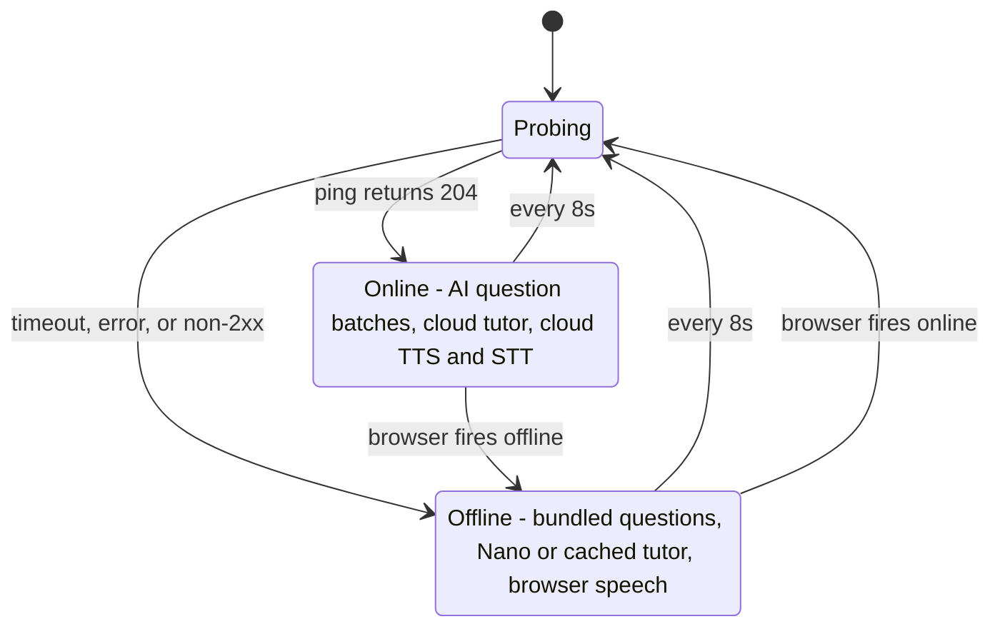
```mermaid
stateDiagram-v2
  [*] --> Probing
  Probing --> Online: ping returns 204
  Probing --> Offline: timeout, error, or non-2xx
  Online --> Probing: every 8s
  Offline --> Probing: every 8s
  Offline --> Probing: browser fires online
  Online --> Offline: browser fires offline
  Online: Online - AI question batches, cloud tutor, cloud TTS and STT
  Offline: Offline - bundled questions, Nano or cached tutor, browser speech
```

### Offline-First PWA

- Vite + Workbox through `vite-plugin-pwa`.
- App shell and bundled assets are precached.
- Latest verified build precached 117 entries, including sound effects, visual aids, and the textured 3D assets.
- `navigateFallback: index.html` with `navigateFallbackDenylist: [/^\/api\//]` — an offline reload or reopen resolves the cached shell instead of the browser's error page, while `/api/*` requests are never answered from the precache.
- Service worker auto-refreshes installed app bundles.
- No accounts required.
- No client-side API keys.

## Demo Flow

1. Open https://gabay-sage.vercel.app.
2. Onboard: pick a grade (4, 5, or 6) and enter a name.
3. Choose a language: Taglish, Tagalog, or English.
4. Browse the hallway and pick a lesson.
5. Open the lesson brief, then enter 2D Class or 3D Class (try switching room themes in 3D).
6. Answer practice questions and watch mastery update.
7. Tap **Itaas ang kamay / Raise your hand** and use the mic or type a question.
8. Open Games and try Store, Garden, House Builder, or Fiesta practice.
9. Turn network off after first load and show that the core app still works.
10. For the strongest demo moment, enable on-device Gemini Nano beforehand (see `docs/NANO_SETUP.md`) and repeat step 7 in airplane mode — Teacher Gabay still answers, fully offline.

## What Works Offline

- App shell and main screens
- Onboarding, language, and grade selection
- Bundled curriculum content
- Lesson explanations and examples
- Practice questions (bundled rotation, used whenever AI generation is unavailable)
- Local answer checking
- Mastery and review history
- Four curriculum mini-games: Store, Garden, House Builder, and Fiesta
- 2D classroom practice
- 3D classroom assets, room themes, and interaction
- Background music and sound effects
- Teacher Gabay tutor replies, on Chrome builds with Gemini Nano available
- Browser speech synthesis fallback when supported by the device

## What Needs Internet

- AI-generated adaptive question sessions (`api/questions.js`)
- Teacher Gabay tutor, when on-device Gemini Nano isn't available (`api/tutor.js`)
- Gemini Flash audio transcription
- Google Cloud Text-to-Speech
- Vercel API routes generally
- The `api/ping.js` reachability probe (its failure is exactly how the app learns it is offline)
- First-time loading before the service worker has cached the app

## Tech Stack

| Layer | Technology |
| --- | --- |
| Frontend | React 19, Vite 6, Tailwind CSS |
| PWA | vite-plugin-pwa, Workbox (117 precached entries, `navigateFallback` to the cached shell) |
| Connectivity | `api/ping.js` 204 probe polled every 8s, plus a 3s pre-flight check before AI generation |
| Local Storage | IndexedDB through idb-keyval |
| Audio | Web Audio API — procedural music/SFX plus a few bundled samples |
| 3D | Three.js, procedural geometry, bundled textures, 5 selectable room themes |
| AI Tutor | On-device Gemini Nano (Chrome Prompt API) → Gemini/Vertex via Vercel Functions → cached fallback |
| Adaptive Questions | Gemini 2.5 Flash (generate + independent verify), rate-limited via Upstash/Vercel KV or in-memory |
| Speech-to-Text | Gemini 2.5 Flash, Web Speech fallback |
| Text-to-Speech | Google Cloud TTS, browser speechSynthesis fallback |
| Testing | Node.js built-in test runner (`node --test`) |
| Deployment | Vercel (primary); static build also ships to OpenAI Sites via a Cloudflare Worker adapter |

## Project Map

```text
src/
  App.jsx                 screen routing, grade/language state, mastery wiring
  content.json             legacy single-grade bundle (superseded by src/curriculum/*)
  content.generated.json   scripted content-generation output, staged for manual review
  main.jsx                app bootstrap and service worker registration
  curriculum/
    grade1.json .. grade6.json   MATATAG competencies per grade (4-6 are loaded; 1-3 are staged)
    teaching-overrides.json      targeted per-item/per-competency content repairs
  assets/
    nova.png, nova-clean.png     mascot artwork
  lib/
    api-base.js            resolves the API origin for Vercel vs. a static Sites build
    check.js                answer checking
    content.js               lazy grade-scoped curriculum loader (grades 4-6)
    content-catalog.js       eager all-grade catalog used by API routes
    curriculum-overrides.js  applies teaching-overrides.json fixes
    difficulty.js            competency -> difficulty tier (madali/katamtaman/mahirap)
    feedback.js              localized correctness feedback + haptics
    grades.js                supported-grade source of truth
    history.js               local review attempt history
    i18n.js                  UI string table
    lang.js                  global language persistence
    lesson-teaching.js        rule-based lesson explanations/guides
    mastery.js                IndexedDB mastery + spaced repetition, per grade
    progress.js               shared started/in-progress/completed vocabulary
    question-quality.js       learner-facing question validation rules
    question-session.js       AI batch + 3s reachability pre-flight + bundled fallback
    sound.js                  procedural music/SFX + bundled sample playback
    speech.js                 online/offline voice-out
    strip-markdown.js         plain-text cleanup for AI replies
    theme.js                  persisted 3D classroom theme
    topics.js                 child-friendly topic metadata
    tutor.js                  Teacher Gabay Nano -> online -> cached fallback chain
    visual-assets.js          registry of illustrated learning visuals
    voicein.js                mic recording + transcription fallback
  screens/
    Splash.jsx              app entry
    Onboarding.jsx          grade + name capture (first run)
    Lessons.jsx             hallway / recommended lesson list
    TopicPicker.jsx         full competency browser
    LessonBrief.jsx         lesson overview + 2D/3D entry
    Classroom.jsx           2D Teacher Gabay classroom
    Classroom3D.jsx         React harness for 3D classroom
    Generating.jsx          loading state while a question session is prepared
    Games.jsx               four curriculum mini-games + summaries
    Progress.jsx            mastery + review + grade switch
  three/
    scene.js                3D classroom logic + room themes
    textures.js              bundled texture imports
  ui/
    BottomNav.jsx           persistent navigation
    Icons.jsx               app icons
    LearningVisual.jsx      illustrated question/choice visuals
    LessonIcon.jsx          competency -> icon mapping
    OnlineBadge.jsx         online/offline status
    Primitives.jsx          cards, buttons, chips, rich text, mastery bar
    Mascot.jsx              Teacher Gabay mascot
    SoundToggle.jsx         floating mute/music toggle
    StepScaffold.jsx        guided multi-step answer flow
api/
  _shared.js               CORS, origin allow-list, body size, rate limiting
  ping.js                  204 no-op reachability probe (real online/offline signal)
  tutor.js                 Gemini/Vertex tutor endpoint
  questions.js              adaptive question generation + verification endpoint
  transcribe.js             Gemini Flash transcription endpoint
  tts.js                    Google Cloud TTS endpoint
public/
  ui-assets/                illustrated visual-aid library (see its own README)
  sfx/, doodles/            bundled audio samples and decorative art
textures/
  *.png                     classroom wall, floor, poster, rug, window assets
Term1/ Term2/ Term3/        curriculum packets and assessments
scripts/                   content generation, difficulty classification, QA repair,
                            curriculum import, icon/screenshot tooling (see below)
test/                      Node test-runner suites for lib and API logic
docs/
  NANO_SETUP.md             on-device Gemini Nano setup and demo prep
```

## Run Locally

```bash
npm install
npm run dev
```

Open the Vite URL, usually:

```text
http://localhost:5173
```

## Production Build

```bash
npm run build
npm run preview
```

Use `npm run preview` for PWA testing because the service worker behaves like production only after a build.

A second static-only build target exists for OpenAI Sites:

```bash
npm run build:sites
```

This builds normally, then reshapes `dist/` into `dist/client` + `dist/server` (the latter wrapping `scripts/sites-worker.js`, a Cloudflare Worker that serves the SPA and falls through to `index.html`). `VITE_QUESTION_API_BASE` is set automatically so `/api/*` calls still reach the Vercel deployment from a Sites-hosted build.

## Offline Test

1. Run `npm run build`.
2. Run `npm run preview`.
3. Open the preview URL once while online.
4. In DevTools, set Network to **Offline**.
5. Hard refresh the page.
6. Confirm lessons, practice, progress, games, and 3D classroom still load.

## On-Device AI (Gemini Nano)

Teacher Gabay's tutor tries on-device Gemini Nano — Chrome's Prompt API (`window.LanguageModel`) — before anything else. It requires Chrome 138+, ~22 GB free disk for a one-time model download, and a capable GPU; when it's not available the app falls straight through to the online/cached tiers with no user-visible failure. Full setup, verification, and airplane-mode demo steps are in [`docs/NANO_SETUP.md`](docs/NANO_SETUP.md).

## Testing

```bash
npm test
```

Runs Node's built-in test runner (`node --test`) over 13 files in `test/` — 65 tests, all passing on the current tree: content-loader and curriculum integrity, question-quality and question-session logic, mastery/history/progress vocabulary, topic and shape mapping, markdown stripping, lesson-teaching rules, and request validation for the `tutor` and `questions` API routes.

## Grade 1–6 curriculum import

The bundled curriculum is built from the teacher-developed
`DepEd-MATATAG-Mathematics-Grades-1-6` derivative package aligned to the
April 17, 2026 Three-Term Budget of Work. It is not an official DepEd
publication and does not imply DepEd endorsement.

Rebuild the checked-in curriculum JSON from that package with:

```bash
npm run build:curriculum -- /absolute/path/to/DepEd-MATATAG-Mathematics-Grades-1-6
```

The importer maps competencies for all six grades (`scripts/specs/grade1.js` .. `grade6.js`), includes uniquely worded objective items from activity sheets and quizzes, excludes drawing/rubric prompts, and records the source Markdown path and item number on every question. **Only Grades 4–6 are wired into the shipped app** (`src/lib/grades.js`); Grades 1–3 curriculum JSON and a matching illustrated visual-asset pack (`public/ui-assets/`) already exist in the repo, staged for a future scope expansion.

Content-quality tooling that runs against the generated curriculum:

| Script | Purpose |
| --- | --- |
| `npm run classify:difficulty` | Recomputes each competency's `madali`/`katamtaman`/`mahirap` tier from `src/lib/difficulty.js`. |
| `npm run repair:content` | Deterministically fixes rubric-text answer options and degenerate true/false items. |
| `npm run gen:content` | Build-time Gemini/Vertex generator for new competencies, written to `src/content.generated.json` for manual review — never overwrites curated content. |
| `node scripts/shoot.mjs` | Playwright screenshot walkthrough of the running preview build, for design QA. |

## Environment Variables

Copy `.env.example` when configuring online AI services:

```bash
cp .env.example .env
```

Variables used by the API routes and build-time scripts:

```text
# Tutor (api/tutor.js) — Vertex/Gemini
GCP_PROJECT=
GCP_LOCATION=us-central1
GEMINI_MODEL=gemini-2.5-pro
GCP_SA_KEY=

# Text-to-Speech (api/tts.js) — reuses GCP_SA_KEY
TTS_VOICE=fil-PH-Wavenet-A
TTS_LANG=fil-PH

# Build-time content generation (scripts/generate-content.js)
GEN_MODEL=gemini-2.5-flash

# Adaptive question sessions (api/questions.js)
GEMINI_API_KEY=
QUESTION_MODEL=gemini-2.5-flash
QUESTION_RATE_LIMIT=8
QUESTION_CORS_ORIGINS=https://gabay-sage.vercel.app

# Optional durable per-IP rate limiting (Upstash or Vercel KV REST credentials).
# Falls back to an in-memory per-instance limiter when unset.
UPSTASH_REDIS_REST_URL=
UPSTASH_REDIS_REST_TOKEN=

# Client-only API origin for a Sites build; leave blank on Vercel.
VITE_QUESTION_API_BASE=
```

### AI APIs Used

- **Teacher Gabay tutor:** on-device Gemini Nano first (Chrome Prompt API, fully offline), then Google Vertex AI / Gemini through `api/tutor.js` (default model `gemini-2.5-pro`, configurable with `GEMINI_MODEL`), then a cached bundled explanation.
- **Adaptive question sessions:** Gemini through `api/questions.js`; complete batches are generated and independently verified before use, with automatic bundled fallback and shared CORS/rate-limit guarding (`api/_shared.js`).
- **Voice input transcription:** Gemini API audio understanding through `api/transcribe.js`; default model is `gemini-2.5-flash`, configurable with `STT_MODEL`.
- **Voice output:** Google Cloud Text-to-Speech through `api/tts.js`; default Filipino voice is `fil-PH-Wavenet-A`, configurable with `TTS_VOICE`.
- **Offline fallback:** on-device Gemini Nano, browser `speechSynthesis`, typed answers, bundled content, and local answer checking keep the core app usable without any cloud APIs.
- **Reachability probe (no AI):** `api/ping.js` returns `204` and nothing else. It exists so the client can tell "really online" from "browser says online", and it is the cheapest call in the app.

Do not commit real service account keys.

## Future Plan and Scaling

Gabay's Grade 4–6 MATATAG math catalog is live; the repo already stages the next expansions below.

### Curriculum Scale-Up

- Wire in the already-imported Grade 1–3 MATATAG data and the matching illustrated visual-asset pack (`public/ui-assets/`) that currently ship unused.
- Add more subjects: Science, English, Filipino, Araling Panlipunan, and TLE.
- Convert the included term PDFs into structured lesson packs.
- Add teacher-authored modules that can be downloaded once and reused offline.

### Personalization

- Use mastery history to recommend daily practice sets.
- Add learner profiles for siblings or shared classroom devices.
- Generate remedial paths for topics with repeated mistakes.
- Add parent/teacher summaries that work offline and sync when internet returns.

### AI Tutor Improvements

- Expand on-device Gemini Nano coverage as Chrome's availability criteria loosen.
- Improve Taglish speech recognition with shorter prompts and better retry states.
- Cache successful tutor explanations per competency for faster offline reuse.
- Add teacher-controlled prompts so schools can tune tone, language, and difficulty.

### Classroom and Game Expansion

- Add more explorable 3D rooms beyond the current five themes: library, math lab, school canteen, and home study corner.
- Add more game themes, challenge modes, and unlockable mastery rewards across the current mini-game system.
- Add classroom NPC dialogue for guided hints and encouragement.
- Add unlockable visual rewards tied to mastery, not ads or purchases.

### School Rollout Path

- Package lesson sets for low-connectivity schools.
- Support local-first sync for computer labs and tablets.
- Add teacher dashboards only after the learner app is stable.
- Keep the core app lightweight enough for budget Android devices.

## Call to Action

Try Gabay with one real learner and one real weak-signal scenario.

- **For judges:** test the airplane-mode flow after first load — with Gemini Nano enabled, even the AI tutor keeps answering.
- **For teachers:** review the curriculum packs and suggest missing classroom examples.
- **For learners:** pick a grade and language, answer a lesson, then ask Teacher Gabay a question.
- **For contributors:** help wire in the staged Grade 1–3 content, or add more DepEd-aligned lesson packs, games, and offline-first learning tools.

**Gabay's goal:** make AI-assisted learning useful even when the internet is not reliable.

## Judging Highlights

- **Impact:** built for Filipino learners with unreliable connectivity.
- **Curriculum depth:** 155 Grade 4–6 competencies across three domains, plus term resource packets.
- **Offline reliability:** local content, local checking, local mastery, cached app shell that survives a reload with no network.
- **Honest connectivity:** a real probe decides online vs. offline, so a throttled or captive-portal network degrades gracefully instead of hanging.
- **AI with graceful fallback:** on-device Gemini Nano, then cloud Gemini/TTS/STT when available, typed/offline flows otherwise.
- **Verified AI content:** adaptive question batches are independently re-checked by a second AI pass before learners ever see them.
- **Multimodal experience:** 2D tutor, themeable 3D classroom, voice, sound design, and game-based practice.
- **Demo clarity:** easy airplane-mode moment after first load — even AI tutoring can survive it.

## Current Status

Built and deployed:

- Offline PWA shell (117 precached entries, cached-shell fallback on offline reload)
- Real reachability detection through `api/ping.js`, with a fast pre-flight before AI generation
- Onboarding with grade selection and global language picker
- 155 Grade 4–6 competencies across three domains
- 2D Teacher Gabay classroom with guided multi-step answering
- Textured 3D classroom with five selectable room themes
- Four curriculum mini-games
- Progress and review tracking, with in-app grade switching
- Online/offline status indicators
- On-device Gemini Nano tutor path
- Gemini/Vertex tutor endpoint
- AI-generated, independently verified adaptive question sessions
- Gemini Flash transcription endpoint
- Google Cloud TTS endpoint
- Procedural sound design (music + SFX)
- Node test-runner suite covering core libs and API validation
- Vercel production deployment, plus a secondary OpenAI Sites build target

Final polish before judging:

- Add in-app screenshots or a demo GIF (`node scripts/shoot.mjs` walks the running preview build with Playwright).
- Run a full demo on the exact phone/laptop used for judging.
- Test mic permission and Taglish transcription on the demo device.

## Visual Identity and Assets

Every image, texture, and sound in Gabay is bundled and precached - nothing loads from a CDN, so the look and feel survives airplane mode. All artwork is original project work by Team CrossCampus.

### Logos and app icons

<p align="center">
  
  
  
  
  
  
</p>

| Asset | File | Used for |
| --- | --- | --- |
| Mascot (vector) | `public/mascot.svg` | Teacher Gabay in speech bubbles and headers |
| Mascot (raster) | `src/assets/nova.png`, `src/assets/nova-clean.png` | `src/ui/Mascot.jsx` renders and splash art |
| Browser icon | `public/nova.png`, `public/favicon.svg` | `index.html` favicon |
| App icons | `public/pwa-192x192.png`, `public/pwa-512x512.png` | PWA manifest, installed home-screen icon |
| Maskable icon | `public/maskable-512x512.png` | Android adaptive-icon safe zone |
| Social card | `public/og.png` | Open Graph and Twitter card |

Regenerate the icon set from source art with `npm run icons` (`scripts/generate-icons.mjs`, backed by sharp).

### Home and game artwork

<p align="center">
  
  
  
  
</p>

<p align="center">
  
  
  
  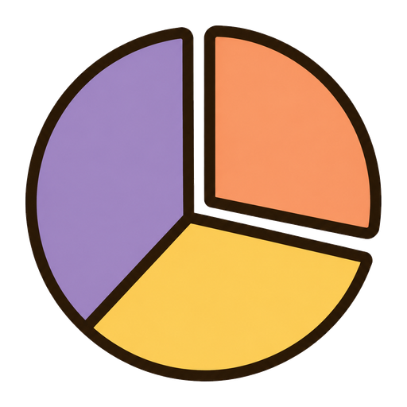
</p>

| Art | File | Where it appears |
| --- | --- | --- |
| Lessons card | `public/home-book.png` | Home hub, Lessons tile |
| Classroom card | `public/home-star.png` | Home hub, Teacher Gabay tile |
| Games card | `public/home-arcade.png` | Home hub, Games tile |
| Greeting hero | `public/home-greeting-hero.png` | Home header background (`src/screens/Home.css`) |
| Store / Tindahan | `public/game-store.png` | Games grid (`src/screens/Games.jsx`) |
| Garden / Hardin | `public/game-garden.png` | Games grid |
| House Builder / Bahay | `public/game-house.png` | Games grid |
| Fiesta Booth | `public/game-fiesta.png` | Games grid |
| Splash and app background | `public/gabay-background.webp` | App backdrop (`src/index.css`) |
| Drifting doodles | `public/doodles/bg-tile.png` | Animated background tile, cropped from the splash art |
| Empty-review overlay | `public/review-empty-overlay.png` | TopicPicker empty state |

### 3D classroom textures

<p align="center">
  
  
  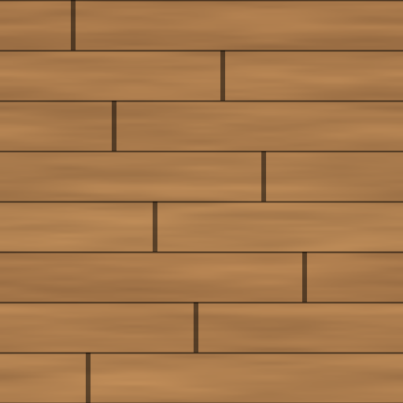
  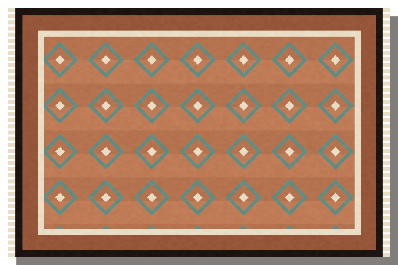
  
  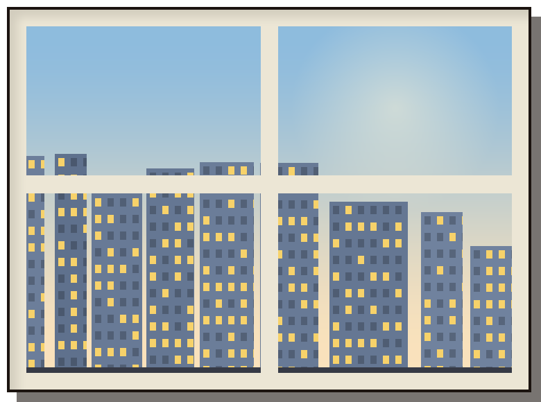
</p>

<p align="center">
  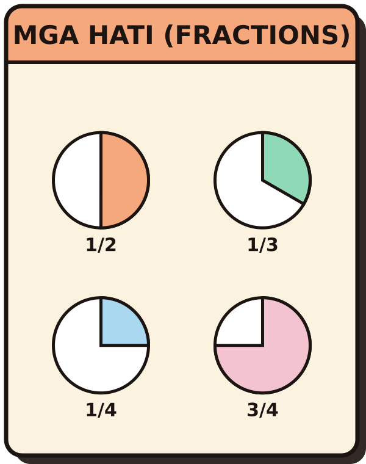
  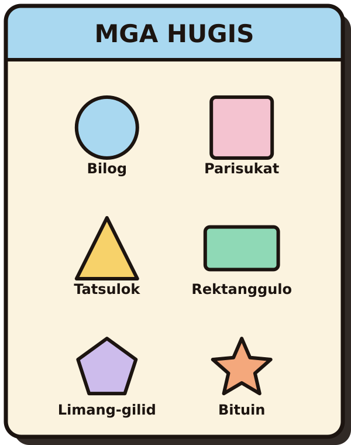
  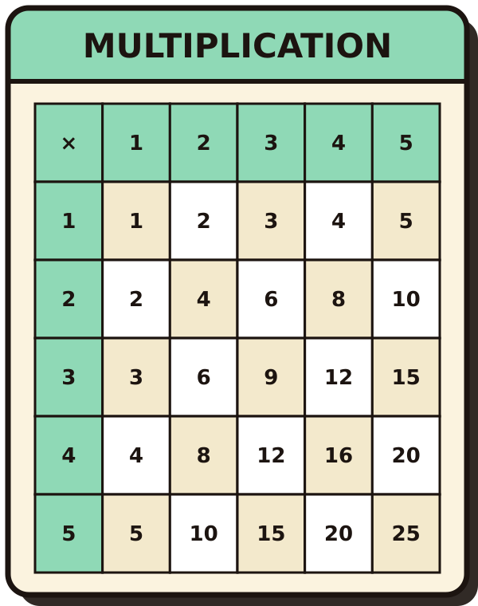
  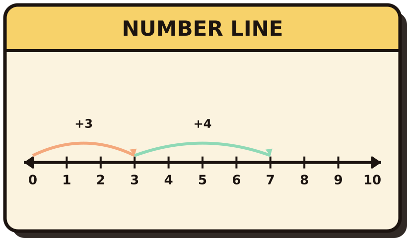
  
</p>

20 textures in `textures/` - seamless walls, wainscot, trim, two floor types, ceiling, chalkboard slate, corkboard, upholstery, rug, window view, and five classroom posters. Pixel sizes, tileability, and the intended surface for each file are documented in [`textures/README.md`](textures/README.md). They are imported through `src/three/textures.js` so the bundler fingerprints and precaches them.

### Illustrated learning visuals

<p align="center">
  
  
  
  
  
  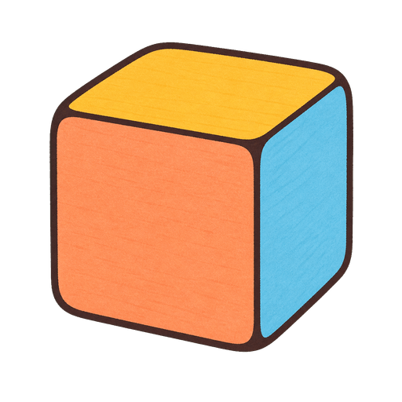
</p>

<p align="center">
  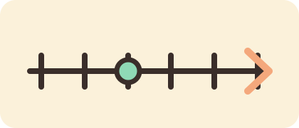
  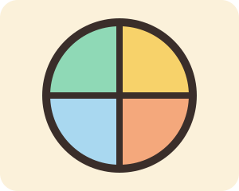
  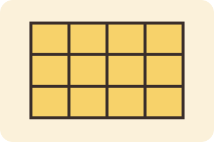
  
  
  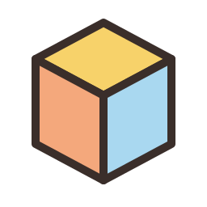
  
  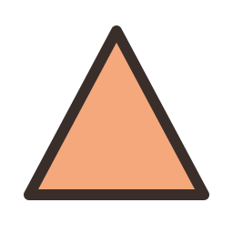
</p>

65 assets in `public/ui-assets/` - 21 PNG illustrations of Filipino-context objects and 44 exact SVG math models (shapes, solids, number lines, fraction circles, clocks, money, graphs, arrays, symmetry). They are text-free and answer-free on purpose: the app composes them in code through `src/lib/visual-assets.js` and `src/ui/LearningVisual.jsx` so quantities and fractions stay mathematically exact and every label stays localizable. Per-file intended uses are in [`public/ui-assets/README.md`](public/ui-assets/README.md).

### Sound

`public/sfx/` ships five recorded button taps (`button1-5.wav`) and one nav-tap clip (`miraclei.mp3`). Everything else - background music plus the correct, wrong, coin, click, and finish cues - is synthesized live from Web Audio oscillators in `src/lib/sound.js`, so most of the sound design costs zero bytes and is offline by construction.

### Asset inventory

| Group | Count | Location |
| --- | --- | --- |
| Logos, icons, screen art | 17 images | `public/*.png`, `*.svg`, `*.webp` |
| Mascot renders | 2 | `src/assets/` |
| Illustrated learning visuals | 65 (21 PNG + 44 SVG) | `public/ui-assets/` |
| 3D classroom textures and posters | 20 PNG | `textures/` |
| Recorded audio | 6 files | `public/sfx/` |
| Procedural audio | 0 files, generated at runtime | `src/lib/sound.js` |
| Decorative doodle tile | 1 | `public/doodles/` |

### Design language

- **Mascot:** Teacher Gabay, a friendly star guide for math practice.
- **Classroom style:** warm low-poly classroom with real bundled textures, in five selectable color themes.
- **UI style:** soft neo-brutal cards, pastel colors, bold outlines, and large tap targets.
- **Brand colors:** `#F7D26A` amber primary, `#1C1410` ink, `#8FD9B6` mint, `#A9D8F0` sky, `#F4C3D0` rose.
- **Tagline:** *Your offline AI Math Companion.*
- **Demo line:** On-device AI when nothing else works. Online AI when available. Offline learning always.

## References and Citations

- [DepEd MATATAG Curriculum](https://www.deped.gov.ph/matatag-curriculum/) - curriculum grounding and learning competency alignment.
- [React Documentation](https://react.dev/) - component-based frontend framework used by the app.
- [Vite Guide](https://vite.dev/guide/) - frontend build tool and development server.
- [Workbox Precaching](https://developer.chrome.com/docs/workbox/modules/workbox-precaching) - service worker precaching model used for offline-first behavior.
- [Three.js Documentation](https://threejs.org/docs/) - WebGL 3D rendering library used for the classroom simulation.
- [Chrome Prompt API / Gemini Nano](https://developer.chrome.com/docs/ai/built-in) - on-device language model used for fully offline tutoring.
- [Gemini API Audio Understanding](https://ai.google.dev/gemini-api/docs/audio) - audio input support used by the transcription flow.
- [Google Cloud Text-to-Speech Documentation](https://cloud.google.com/text-to-speech/docs) - cloud voice generation used by Teacher Gabay when online.
- [Vercel Deployments Documentation](https://vercel.com/docs/deployments) - production hosting and serverless API deployment platform.

## Credits

Built by **Team CrossCampus**.

Gabay means guide or mentor in Filipino. The project is built as a practical study companion for Filipino learners, with math examples grounded in familiar local contexts and a classroom experience designed for mobile-first use.
